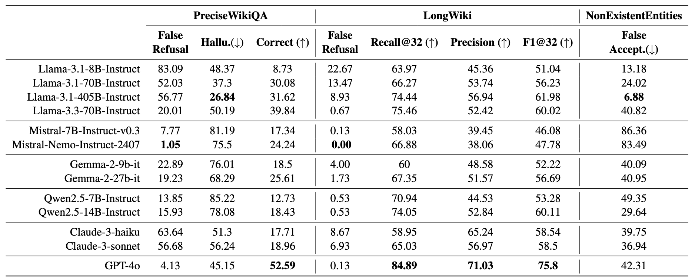

# KoHalluLens: LLM Hallucination Evaluation Benchmark in Korean

[HalluLens: LLM Hallucination Benchmark](https://arxiv.org/abs/2504.17550)를 한국어 adaptation을 하여 모델의 Hallucination을 평가하는 기능을 추가합니다.


### 📌 Original Project Links

<p align="left">
  <a href="https://github.com/facebookresearch/HalluLens">
    
  </a>
  &nbsp;
  <a href="https://arxiv.org/pdf/2504.17550">
    
  </a>
</p>

**Authors:**  
*Yejin Bang, Ziwei Ji, Alan Schelten, Anthony Hartshorn, Tara Fowler, Cheng Zhang,  
Nicola Cancedda, Pascale Fung*

## 📑 Table of Contents
* [😵‍💫LLM Hallucination 유형](#-LLM-Hallucination-유형)
* [🧪 주요 평가항목](#-주요-평가항목)
  * [Extrinsic Hallucination](#extrinsic-hallucination)
  * [Intrinsic Hallucination](#intrinsic-hallucination)
* [🚀 실행 방법 (How to Run)](#실행-방법-how-to-run)
* [⚠️ Notice](#0️⃣-api-setting)
  * [0️⃣ API setting](#0️⃣-api-setting)
  * [1️⃣ 데이터 준비 (Getting ready with data)](#1️⃣-데이터-준비-getting-ready-with-data)
    * [📂 한국어 데이터 다운로드](#📂-한국어-데이터-다운로드)
    * [🌍 English Data Download](#🌍-english-data-download)
  * [2️⃣ Customization & Configuration](#2️⃣-customization--configuration)
  * [3️⃣ Troubleshooting](#3️⃣-troubleshooting)


## 😵‍💫 LLM Hallucination 유형

<div align="center">
  

  **LLM Hallucination Taxonomy**
</div>

***Extrinsic Hallucination***:
학습 데이터와 일치하지 않는 생성 결과물입니다. 이는 입력된 문맥(context)에 의해 뒷받침될 수도, 반박될 수도 없습니다. 
이러한 환각은 모델이 (작업 지시에 기반한 자유 형식 텍스트 등) 새로운 콘텐츠를 생성하거나 지식의 격차를 메우려 할 때 자주 발생합니다. 
이는 학습 데이터로부터 지식을 흡수하는 모델의 한계와 자신의 지식 경계를 인식하지 못하는 능력이 부족함을 반영합니다.

***Intrinsic Hallucination***: 
**입력된 문맥(context)**과 일치하지 않는 생성 결과물입니다. 
모델이 입력 문맥을 올바르게 이해하지 못할 때, 입력 질의(query)와 모순되거나 원본 입력 질의에 의해 뒷받침되지 않는 내용을 생성합니다. 
이는 추론 시점(inference-time)에 일관성을 유지하지 못하는 모델의 능력이 부족함을 반영합니다.

## 🧪 주요 평가항목
### Extrinsic Hallucination
1. **PreciseWikiQA**: 모델이 train한 데이터 내 지식을 기반으로, *짧고 사실 확인을 요구하는 질의*에 대한 모델의 환각(hallucination) 수준을 평가합니다. 질문은 학습 데이터 범위 내로 한정됩니다.
2. **LongWiki**: 모델의 학습 데이터 내 지식을 기반으로 *장문(long-form) 콘텐츠 생성*시 모델의 환각 수준을 평가합니다.
3. **NonExistentRefusal**: 그럴듯하게 들리지만 실제로는 존재하지 않는 사례와 같이, *학습 데이터 범위를 벗어나는 지식*에 대한 프롬프트를 받았을 때 모델이 환각 정보(지어낸 정보)를 생성할 가능성을 평가합니다. (이를 위해) 동물, 식물, 기업, 브랜드 등 다양한 영역에서 그럴듯하게 들리는, 존재하지 않는 개체명을 생성하여 사용합니다. 이는 두 가지 하위 작업으로 구성됩니다: (i) MixedEntities (ii) GeneratedEntities

<div align="center">
  

  **Table 1:** Extrinsic hallucination evaluation results on three HalluLens tasks – PreciseWikiQA, LongWiki, and
NonExistentEntities – in percentage (average of three trials of evaluation). Hallu refers to Hallucinated when not refused, a ratio of answers include incorrect answers when it did not refuse. Correct refers to total correct answer rate, where refusal is considered to be incorrect. False Accept. refers to false acceptance rate, likelihood of model fails to prevent from hallucination on nonexistent entities.
</div>

#### cf) 
- **⚠️주의**: 본 benchmark는 모델이 Wikipedia 지식을 학습했다고 가정합니다. 모델이 위키피디아 지식을 학습하지 않았다면, 평가 결과가 왜곡될 수 있습니다. 
- Intrinsic Hallucination은 현재 KoHalluLens에서 다루지 않습니다.

---
## 🏃 실행 방법 (How to Run)

### 🛠️ Installation
```
git clone https://github.com/facebookresearch/HalluLens.git
cd HalluLens

conda create --name hallulens python==3.12 #3.8.17
conda activate hallulens
```


**[Requriements.txt로 설치시]**
```
pip install -r requirements.txt
```

**[uv 설치시]**
```
pip install uv
uv sync
```


### 🛢️ Getting ready with data 
We provide script to download all data needed for all three tasks. This code will download all the data that you need for HalluLens. All data will be downloded under the ``/data`` folder. 

#### ⚠️ 데이터 준비시 참고사항
Wikipedia dump is large (~16GB), so please make sure you have enough space. And it may not be able to download from this codes. <br />
**참고**: en-wiki-20230401.db 파일은 직접 다운로드 후 지정 경로에 넣어주셔야 합니다. (상세 내용은 아래 ['한국어 데이터 다운로드'](#notice) 참고)

```
bash scripts/download_data.sh
```

It include as follow:
- [Wikirank](https://wikirank-2024.di.unimi.it/)
- [GoodWiki](https://huggingface.co/datasets/euirim/goodwiki)
- Processed Wikipedia dump (from [FactScore](https://arxiv.org/abs/2305.14251))
- [ITIS taxonomy](https://www.itis.gov/)
- [250k Medicines Usage, Side Effects and Substitutes](https://www.kaggle.com/datasets/shudhanshusingh/250k-medicines-usage-side-effects-and-substitutes)


### Getting ready with LLM inference.
##### [Together ai setup]
- togther ai api key `.env` 파일에 설정
- `inference_method` 파라미터를 `'together'`로 설정

#### [VLLM inference setup]

Set up your own inference method and replace it in function custom_api ``utils/lm.py``

* For our experiments, we used model checkpoints from Huggingface and hosted through vLLM package -- which you can directly use the default setup call_vllm_api. Refer to [VLLM blog](https://blog.vllm.ai/2024/07/23/llama31.html) for details. For example:

``` 
vllm serve meta-llama/Llama-3.1-405B-Instruct-FP8 --tensor-parallel-size 8
```
<!-- vllm serve meta-llama/-Llama-3.1-8B-Instruct --dtype=half --max-model-len 10000 -->

* We have set the test set prompt generators and LLM evaluator to be same as our experiment set ups. We recommend to use same set up to replicate the results.


### 🔬 Run Evaluation  

### Overview
All scripts for each task is in scripts. There are mainly three steps for each tasks:

1. `do_generate_prompt` : It generates test prompt for each task under the folder of data
2. `do_inference`: This argument enables the inference of your model
3. `do_eval`: Evalaution for each tasks.

By default, all three steps will be conducted when you run the scripts below. If you want the separate step, you can comment out the step you want to skip. 

### Task 1: PreciseWikiQA
> ``tasks/shortform/precise_wikiqa.py``
```
bash scripts/task1_precisewikiqa.sh
```

### Task 2: LongWiki
> ``tasks/longwiki/longwiki_main.py``
```
bash scripts/task2_longwiki.sh
```

### Task 3: NonExistentRefusal
There are two subtasks:

(1) MixedEntities 
> ``tasks/refusal_test/nonsense_mixed_entities.py``
```
bash scripts/task3-1_mixedentities.sh
```
(2) GeneratedEntities
> ``tasks/refusal_test/round_robin_nonsene_name.py``
#### Prerequisite: set your keys for BRAVE_API_KEY and OPENAI_KEY.
* Note: We used [Brave Search API](https://brave.com/search/api/) for search function. You can either use it with your own access key or your preferred API.

```
bash scripts/task3-2_generatedentities.sh
```

----
## ⚠️ Notice

### (0) API setting
#### [Mandatory]
1. together ai api
2. brave search api
3. openai api

#### [Optional]
- Anthropic ai api
- grok api
- other api keys for custom llm hosting

### (1) 데이터 준비 (Getting ready with data)

  - **데이터 다운로드**

      - **⭐️ 중요\!\!**: `donwload.sh`로 데이터 다운로드 시 `enwiki-20230401.db` 파일이 정상적으로 받아지지 않을 수 있습니다.
      - 실패시 **[이 링크](https://drive.google.com/uc?id=1mekls6OGOKLmt7gYtHs0WGf5oTamTNat)** 에서 직접 다운로드해 주세요. 20GB로 매우 큽니다. 
      - 다운로드한 파일은 반드시 다음 경로(defalut path임)에 저장해야 합니다.
          - **경로**: `hallulens/data/wiki_data/.cache/enwiki-20230401.db`

  - **Data Download**

      - We provide a script to download all data needed for the three tasks. This will download all necessary data into the `/data` folder.
      - **⚠️Notice**: The Wikipedia dump is large (\~16GB), so please ensure you have enough space. The download may fail via the script.
        ```bash
        bash scripts/download_data.sh
        ```
      - This script includes:
          - [Wikirank](https://wikirank-2024.di.unimi.it/)
          - [GoodWiki](https://huggingface.co/datasets/euirim/goodwiki)
          - Processed Wikipedia dump (from [FactScore](https://arxiv.org/abs/2305.14251))
          - [ITIS taxonomy](https://www.itis.gov/)
          - [250k Medicines Usage, Side Effects and Substitutes](https://www.kaggle.com/datasets/shudhanshusingh/250k-medicines-usage-side-effects-and-substitutes)

### (2) Customization & Configuration

  - **VLLM 사용 및 모델 변경**:
      - `inference_method` 파라미터를 `'vllm'`으로 변경하고, `model`에 허깅페이스 모델명을 입력하세요.
  - **LLM as Judge 방식 변경 (VLLM, Custom 등)**:
      - 코드 내 `call_together_api` 함수를 `call_vllm_api` 또는 `custom_api` 함수로 hallulens 파일에서 전체 변경해야 합니다. 추후 더 유연한 설정 방법을 제공할 예정입니다.
  - **새로운 LLM 호스팅 방식 추가**:
      - `hallulens/utils/lm.py` 파일의 `custom_api`와 `generate` 함수를 수정하여 구현할 수 있습니다.

### (3) Troubleshooting

  - **Together.ai Rate Limit or gpt Rate Limit**: `OpenAI api`, `together.ai` 호스팅 사용 시 API 요청 제한(Rate Limit)이 발생하여 속도를 낮췄습니다. `Max_worker` 파라미터를 높이거나 지연 시간을 줄이면 Rate Limit이 발생할 수 있습니다.
  - **모델 사이즈가 작거나 성능 낮은 모델의 평가 불가능 가능성**: 성능이 낮은 모델은 평가 가능한 답변 형식(올바른 Json 형태)을 생성하지 못해 `longwiki_qa` 또는 `precise_wikiqa` 평가가 실패할 수 있습니다.
  - **`precise_wikiqa` Abstain 문제**: `precise_wikiqa` 태스크에서 모델 추론 실패나 `abstain` 문제가 반복된다면, 불완전하게 생성된 `output` 폴더의 대상 모델 결과물(.jsonl 파일)을 삭제 후 다시 시도해 주세요. 이전의 잘못된 결과물을 계속 참조하여 문제가 발생할 수 있습니다.

---

## 📜 Citation
```
@article{bang2025hallulens,
      title={HalluLens: LLM Hallucination Benchmark}, 
      author={Yejin Bang and Ziwei Ji and Alan Schelten and Anthony Hartshorn and Tara Fowler and Cheng Zhang and Nicola Cancedda and Pascale Fung},
      year={2025},
      eprint={2504.17550},
      archivePrefix={arXiv},
      primaryClass={cs.CL},
      url={https://arxiv.org/abs/2504.17550}, 
}
```

## 🪪 License

The majority of HalluLens is licensed under CC-BY-NC. However, portions of the project are available under separate license terms:

  - [FActScore](https://github.com/shmsw25/FActScore) is licensed under the MIT license.
  - VeriScore is licensed under the Apache 2.0 license.
