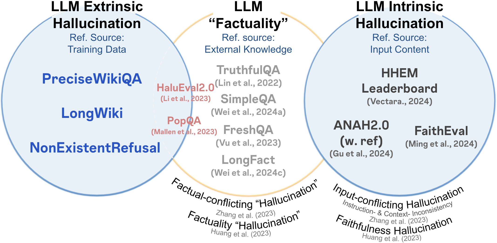

# KoHalluLens: LLM Hallucination Evaluation Benchmark in Korean

**[HalluLens: LLM Hallucination Benchmark](https://arxiv.org/abs/2504.17550)**를 한국어화하여 모델의 \*\*Hallucination(환각 현상)\*\*을 평가하는 기능을 추가합니다.

- 주요 추가 내용: inference method 추가(together ai), 평가내용 Korean adaptation추가 
- [원본 HalluLens repo]("https://github.com/facebookresearch/HalluLens")

## 😵‍💫 LLM Hallucination 유형

<div align="center">
  

  **LLM Hallucination Taxonomy**
</div>

***Extrinsic Hallucination***:
학습 데이터와 일치하지 않는 생성 결과물입니다. 이는 입력된 문맥(context)에 의해 뒷받침될 수도, 반박될 수도 없습니다. 
이러한 환각은 모델이 (작업 지시에 기반한 자유 형식 텍스트 등) 새로운 콘텐츠를 생성하거나 지식의 격차를 메우려 할 때 자주 발생합니다. 
이는 학습 데이터로부터 지식을 흡수하는 모델의 한계와 자신의 지식 경계를 인식하지 못하는 능력이 부족함을 반영합니다.

***Intrinsic Hallucination***: 
**입력된 문맥(context)**과 일치하지 않는 생성 결과물입니다. 
모델이 입력 문맥을 올바르게 이해하지 못할 때, 입력 질의(query)와 모순되거나 원본 입력 질의에 의해 뒷받침되지 않는 내용을 생성합니다. 
이는 추론 시점(inference-time)에 일관성을 유지하지 못하는 모델의 능력이 부족함을 반영합니다.

## 🧪 주요 평가항목
### Extrinsic Hallucination
1. **PreciseWikiQA**: 모델이 train한 데이터 내 지식을 기반으로, *짧고 사실 확인을 요구하는 질의*에 대한 모델의 환각(hallucination) 수준을 평가합니다. 질문은 학습 데이터 범위 내로 한정됩니다.
2. **LongWiki**: 모델의 학습 데이터 내 지식을 기반으로 *장문(long-form) 콘텐츠 생성*시 모델의 환각 수준을 평가합니다.
3. **NonExistentRefusal**: 그럴듯하게 들리지만 실제로는 존재하지 않는 사례와 같이, *학습 데이터 범위를 벗어나는 지식*에 대한 프롬프트를 받았을 때 모델이 환각 정보(지어낸 정보)를 생성할 가능성을 평가합니다. (이를 위해) 동물, 식물, 기업, 브랜드 등 다양한 영역에서 그럴듯하게 들리는, 존재하지 않는 개체명을 생성하여 사용합니다. 이는 두 가지 하위 작업으로 구성됩니다: (i) MixedEntities (ii) GeneratedEntities

cf) 
1. 본 HalluLens는 wiki 데이터가 대부분의 llm에 학습 데이터로 포함되어 있다는 가정 하에 Extrinsic Hallucination을 평가합니다.
2. Intrinsic Hallucination은 현재 KoHalluLens에서 다루지 않습니다.

# TODO: 여기도 써야함
## 실행 방법 (How to Run)


- together ai와 gpt rate limit이 있을수 있기 때문에 max worker를 조정하세요. 혹은 `lm.py`에서 rate_limit 부분을 조정하거나 time_sleep을 조정하세요.
- 

## ⚠️ Notice

### (0) API setting
1. together ai api
2. brave search api
3. openai api

### (1) 데이터 준비 (Getting ready with data)

  - **(한국어) 데이터 다운로드**

      - **⭐️ 중요\!\!**: `donwload.sh`로 데이터 다운로드 시 `.db` 파일이 정상적으로 받아지지 않을 수 있습니다.
      - 실패시 **[이 링크](https://drive.google.com/uc?id=1mekls6OGOKLmt7gYtHs0WGf5oTamTNat)** 에서 직접 다운로드해 주세요.  20GB로 매우 큽니다. 
      - 다운로드한 파일은 반드시 다음 경로에 저장해야 합니다.
          - **경로**: `llm_eval/external/providers/hallulens/data/wiki_data/.cache/enwiki-20230401.db`

  - **Data Download**

      - We provide a script to download all data needed for the three tasks. This will download all necessary data into the `/data` folder.
      - **⚠️Notice**: The Wikipedia dump is large (\~16GB), so please ensure you have enough space. The download may fail via the script.
        ```bash
        bash scripts/download_data.sh
        ```
      - This script includes:
          - [Wikirank](https://wikirank-2024.di.unimi.it/)
          - [GoodWiki](https://huggingface.co/datasets/euirim/goodwiki)
          - Processed Wikipedia dump (from [FactScore](https://arxiv.org/abs/2305.14251))
          - [ITIS taxonomy](https://www.itis.gov/)
          - [250k Medicines Usage, Side Effects and Substitutes](https://www.kaggle.com/datasets/shudhanshusingh/250k-medicines-usage-side-effects-and-substitutes)

### (2) Customization & Configuration

  - **VLLM 사용 및 모델 변경**:
      - `inference_method` 파라미터를 `'vllm'`으로 변경하고, `model`에 허깅페이스 모델명을 입력하세요.
  - **LLM as Judge 방식 변경 (VLLM, Custom 등)**:
      - 코드 내 `call_together_api` 함수를 `call_vllm_api` 또는 `custom_api` 함수로 hallulens 파일에서 전체 변경해야 합니다.
  - **새로운 LLM 호스팅 방식 추가**:
      - `llm_eval/external/hallulens/utils/lm.py` 파일의 `custom_api`와 `generate` 함수를 수정하여 구현할 수 있습니다.

### (3) Troubleshooting

  - **Together.ai Rate Limit**: `together.ai` 호스팅 사용 시 API 요청 제한(Rate Limit)이 발생하여 속도를 낮췄습니다. `Max_worker` 파라미터를 높이거나 지연 시간을 줄이면 Rate Limit이 발생할 수 있습니다.
  - **성능 낮은 모델의 평가 불가**: 성능이 낮은 모델은 평가 가능한 답변 형식(올바른 Json 형태)을 생성하지 못해 `longwiki_qa` 또는 `precise_wikiqa` 평가가 실패할 수 있습니다.
  - **`precise_wikiqa` Abstain 문제**: `precise_wikiqa` 태스크에서 모델 추론 실패나 `abstain` 문제가 반복된다면, 불완전하게 생성된 `output` 폴더의 대상 모델 결과물(.jsonl 파일)을 삭제 후 다시 시도해 주세요. 이전의 잘못된 결과물을 계속 참조하여 문제가 발생할 수 있습니다.

## 🪪 License

The majority of HalluLens is licensed under CC-BY-NC. However, portions of the project are available under separate license terms:

  - [FActScore](https://github.com/shmsw25/FActScore) is licensed under the MIT license.
  - VeriScore is licensed under the Apache 2.0 license.